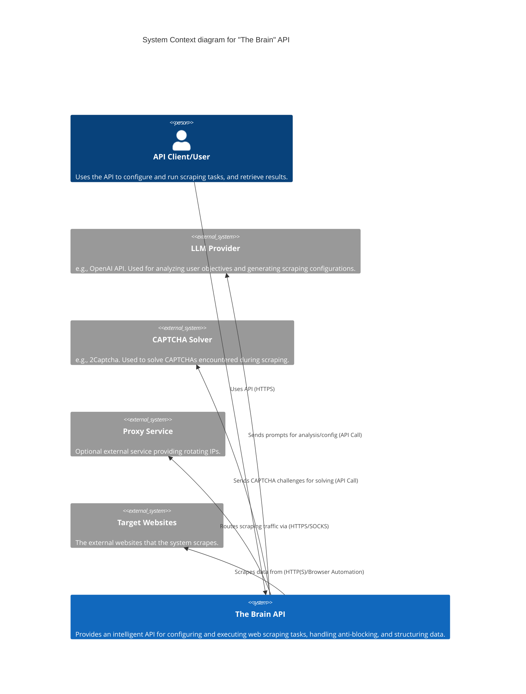

# C4 - System Context Diagram

```mermaid

C4Context
  title System Context diagram for "The Brain" API

  Person(user, "API Client/User", "Uses the API to configure and run scraping tasks, and retrieve results.")

  System_Ext(llm, "LLM Provider", "e.g., OpenAI API. Used for analyzing user objectives and generating scraping configurations.")
  System_Ext(captcha, "CAPTCHA Solver", "e.g., 2Captcha. Used to solve CAPTCHAs encountered during scraping.")
  System_Ext(proxy, "Proxy Service", "Optional external service providing rotating IPs.")
  System_Ext(target_sites, "Target Websites", "The external websites that the system scrapes.")

  System(the_brain, "The Brain API", "Provides an intelligent API for configuring and executing web scraping tasks, handling anti-blocking, and structuring data.")

  Rel(user, the_brain, "Uses API (HTTPS)")
  Rel(the_brain, llm, "Sends prompts for analysis/config (API Call)")
  Rel(the_brain, captcha, "Sends CAPTCHA challenges for solving (API Call)")
  Rel(the_brain, proxy, "Routes scraping traffic via (HTTPS/SOCKS)")
  Rel(the_brain, target_sites, "Scrapes data from (HTTP(S)/Browser Automation)")

  UpdateLayoutConfig($c4ShapeInRow="3", $c4BoundaryInRow="1")


```