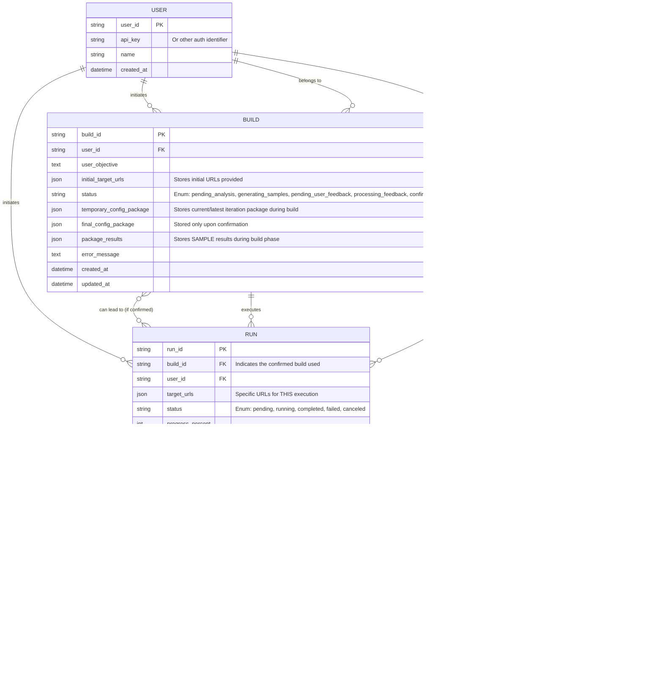

# ERD

```mermaid
erDiagram
    %% Entities representing core concepts
    USER ||--o{ BUILD : "initiates"
    USER ||--o{ RUN : "initiates"

    BUILD {
        string build_id PK
        string user_id FK
        text user_objective
        json initial_target_urls "Stores initial URLs provided"
        string status "Enum: pending_analysis, generating_samples, pending_user_feedback, processing_feedback, confirmed, failed"
        json temporary_config_package "Stores current/latest iteration package during build"
        json final_config_package "Stored only upon confirmation"
        json package_results "Stores SAMPLE results during build phase"
        text error_message
        datetime created_at
        datetime updated_at
    }
    BUILD }o--|| USER : "belongs to"
    BUILD }o--o{ RUN : "can lead to (if confirmed)"
    
    RUN {
        string run_id PK
        string build_id FK "Indicates the confirmed build used"
        string user_id FK
        json target_urls "Specific URLs for THIS execution"
        string status "Enum: pending, running, completed, failed, canceled"
        int progress_percent
        int urls_processed
        int urls_total
        text error_message
        datetime created_at
        datetime updated_at
    }
    RUN }o--|| BUILD : "executes"
    RUN }o--|| USER : "belongs to"
    RUN ||--o{ RUN_RESULT : "produces"
    
    RUN_RESULT {
        string result_id PK
        string run_id FK
        string target_url
        boolean success
        json data "Scraped data for this specific URL"
        text error "Error specific to this URL"
        int statusCode
        datetime timestamp
    }
    RUN_RESULT }o--|| RUN : "belongs to"
    
    USER {
        string user_id PK
        string api_key "Or other auth identifier"
        string name
        datetime created_at
    }
    
    %% Knowledge Base Entities
    BUILD }o--o| KNOWLEDGE_BASE_ENTRY : "can result in (on confirm)"
    KNOWLEDGE_BASE_ENTRY {
        string kb_entry_id PK
        string source_build_id FK "Link back to originating build"
        json platform_identifiers "e.g., ['example.com']"
        string output_schema_hash
        string objective_embedding_id FK "Conceptual link to vector data"
        json config_package "The successful package stored"
        int usage_count
        datetime created_at
    }
    KNOWLEDGE_BASE_ENTRY }o--|| BUILD : "originates from"
    KNOWLEDGE_BASE_ENTRY ||--o| OBJECTIVE_EMBEDDING : "references vector"
    
    %% Vector DB Entity (Conceptual)
    OBJECTIVE_EMBEDDING {
        string embedding_id PK
        string text_source
        vector embedding_vector "High-dimensional vector data"
    }
    OBJECTIVE_EMBEDDING |o--|| KNOWLEDGE_BASE_ENTRY : "represents objective for"
```