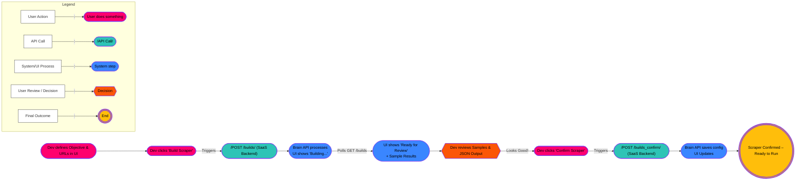
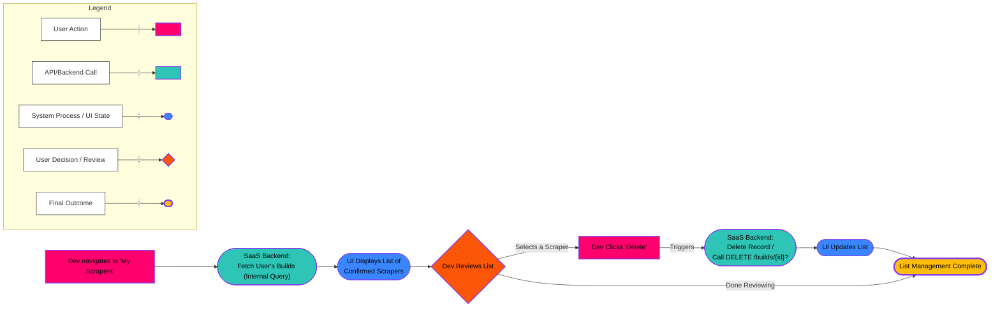
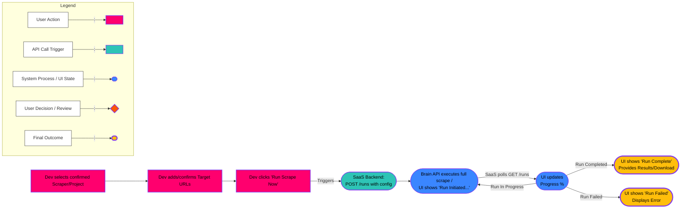
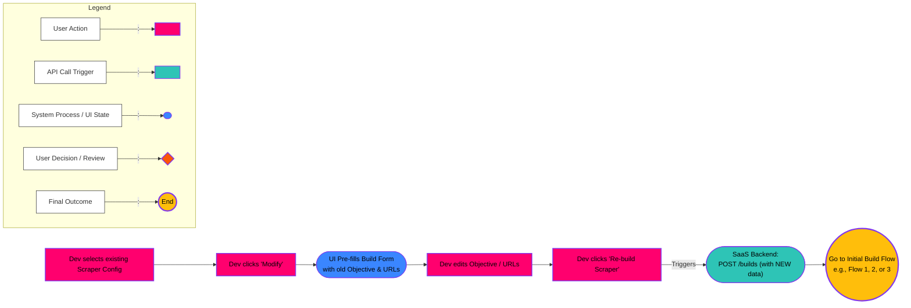

# User Flows

## 1. User flow - Initial Build & Immediate Confirmation

## 2. Userflow - Build with One Round of Feedback

```mermaid
flowchart LR
    %% --- Color Definitions ---
    classDef userAction fill:#ff006e,stroke:#8338ec,stroke-width:2px,color:#000;
    classDef systemProcess fill:#3a86ff,stroke:#8338ec,stroke-width:1px,color:#000;
    classDef apiCall fill:#2ec4b6,stroke:#8338ec,stroke-width:1.5px,color:#000;
    classDef decisionPoint fill:#fb5607,stroke:#8338ec,stroke-width:2px,color:#000;
    classDef finalState fill:#ffbe0b,stroke:#8338ec,stroke-width:3px,color:#000;
    classDef legendText fill:#fff,stroke:#333,color:#333;

    %% --- Flowchart Steps ---
    A[Dev defines Objective & URLs] 
    B[Dev clicks 'Build Scraper']
    C(["SaaS Backend:<br/>POST /builds"])
    D(["Brain API processes /<br/>UI shows 'Building...'"])
    E(["UI shows 'Ready for Review'<br/>Displays initial samples"])
    F{Dev reviews Initial Samples}
    G[Dev enters feedback/corrections in UI]
    H[Dev clicks 'Refine Configuration']
    I(["SaaS Backend:<br/>POST /builds/{id}/configure"])
    J(["Brain API adjusts & re-runs /<br/>UI shows 'Refining...'"])
    K(["UI shows 'Ready for Final Review'<br/>Displays refined samples"])
    L{Dev reviews Refined Samples}
    M[Dev clicks 'Confirm Scraper']
    N(["SaaS Backend:<br/>POST /builds/{id}/confirm"])
    O(["Brain API saves final config /<br/>UI Updates"])
    P(["UI shows 'Scraper Confirmed!'<br/>Ready to Run"])

    %% --- Flow Connections ---
    A --> B
    B -- Triggers --> C
    C --> D
    D -- "SaaS polls" --> E
    E --> F
    F -- "Needs Changes" --> G
    G --> H
    H -- Triggers --> I
    I --> J
    J -- "SaaS polls" --> K
    K --> L
    L -- "Looks Good Now!" --> M
    M -- Triggers --> N
    N --> O
    O --> P

    %% --- Class assignments ---
    class A,B,G,H,M userAction;
    class C,I,N apiCall;
    class D,E,J,K,O systemProcess;
    class F,L decisionPoint;
    class P finalState;

    %% --- Legend ---
    subgraph Legend
        direction LR
        L1[User Action]:::legendText -- : --> L1Ex[ ]:::userAction
        L2[API Call Trigger]:::legendText -- : --> L2Ex[ ]:::apiCall
        L3[System Process / UI State]:::legendText -- : --> L3Ex([" "]):::systemProcess
        L4[User Decision / Review]:::legendText -- : --> L4Ex{ }:::decisionPoint
        L5[Final Outcome]:::legendText -- : --> L5Ex([" "]):::finalState
    end


```

## 3. Userflow - **Managing Existing Scraper Configurations**

**Goal:** The developer wants to see, organize, or possibly delete the scraper configurations they have previously built and confirmed.

## 4. Userflow - Executing a Full Scrape

## 5. Userflow -  **Re-building/Modifying a Scraper Configuration**

**Goal:** The objective or target sites for a previously built scraper have changed slightly. Instead of starting from scratch, the developer wants to adjust the existing setup. (Note: The Brain might just treat this as a *new* build internally, but the UI flow feels like modification).

