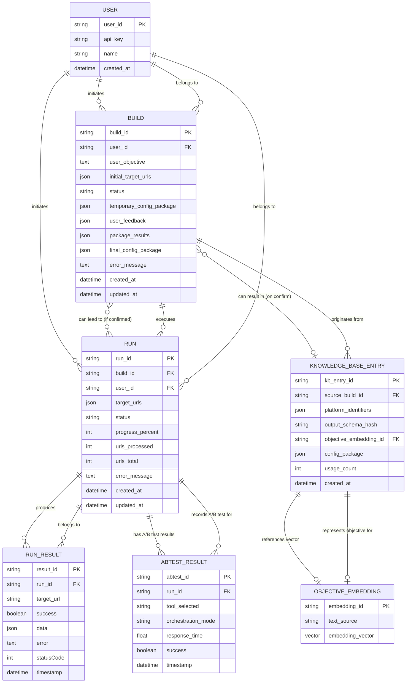

<!--
This document is the single source of truth for the LLM coding assistant. The LLM should reference, update, and maintain this doc as the project evolves. All architectural, design, and implementation decisions should be reflected here.
-->

# ERD

